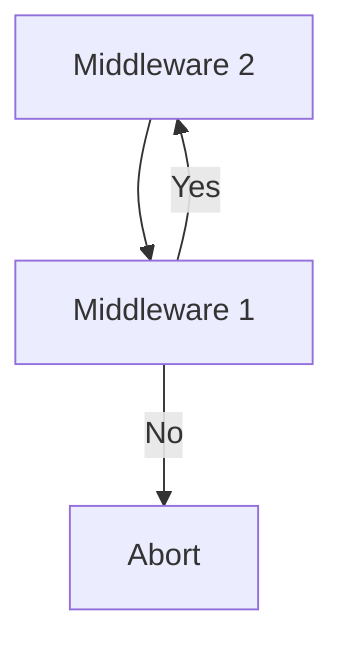

### Introduction

**Tonca** est un **Framework PHP** basé sur le model **MVC** (**M**odel **V**iew **C**ontroller).

Il ne s'agit pas d'une réinventer de la roue, ni d'apporter une quelconque amériolation aux Frameworks existants. Mais plutôt la naissance de **Tonca** est partie d'un constat. Une abstraction énorme et organisée est entrain de gagner le terrain dans le monde du développement. Pour le simple fait que les développeur adorent plus l'esthétique du code jusqu'à en perdre sa valeur.

Les Frameworks sont devneus les maîtres d'orchestre et les développeurs dansent à leur rythme. La roue tourne à l'inverse, ce qui ne devrait pas être le cas ! C'est le code qui écrit le développeur ou bien c'est le développeur qui écrit le code ? Posons nous cette question.

J'ai vu des procédés de code où pour préciser la clause `where` d'une requête SQL, le développeur est appelé à entrer un tableau associatif. Alors qu'en réalité il ne s'agit que d'une portion de chaîne de caractères à préciser. Je me demande pourquoi pas entrer en même temps cette chaîne tant que l'on connaît déjà tous les paramètres ? Comme ça on aurait plus de possibilité et en plus on reste dans la logique du language ! (Plusieurs cas de ce genre sont à évoquer)

Est-ce qu'on apprend ou on désapprend ?

Il fut un temps PHP ne pouvant pas importer une portion de code dans un code parrain sans éclaser les variables globales de ce dernier. Les gens se plaignaient de cela. Et pour y remédier, PHP a apporter une solution magique `namesapce`. Pour moi c'est une grande opportunité pour améliorer la façon dont les middlewares fonctionnnent dans les Frameworks. Il fallait avoir cette possibilité d'imbriquer des middleware jusqu'à l'infini (pour ne pas exagérer :smile:).

Cela nous aiderait à mieux organiser le code. Avoir un fichier à part entière (si possible un dossier) pour chaque middleware.

Je ne suis pas contre le fait que les Frameworks apportent la créativité dans le code, mais plutôt la façon dont cela se fait. On devrait rester dans la logique du language. Aujourd'hui même une bonne maîtrise de PHP ne suffit pas pour être un développeur confirmé; il faut apprendre un tas de Frameworks en plus. Cela ne derrange pas si c'est la même logique qui est respectée par tout ! 

Donc si vous me lisez bien, mon objectif ultime est de corriger le tir. Faire de Tonca un framework pour les développeurs ! pas pour les artisans !

# Prérequis

Une configuaration de base de [PHP](https://www.php.net/downloads.php) et de [Apache](https://httpd.apache.org/download.cgi). Vous aurez certainement besoin d'une base de données par la suite. Vous avez le choix entre tous les drivers supportés par PDO.
